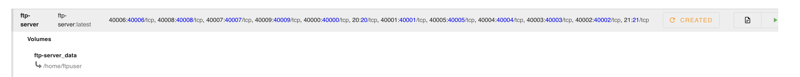
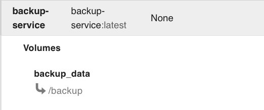
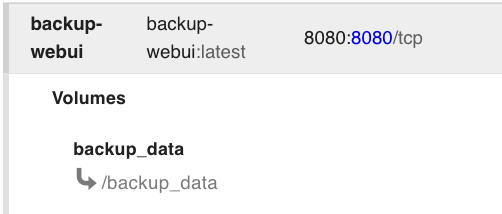
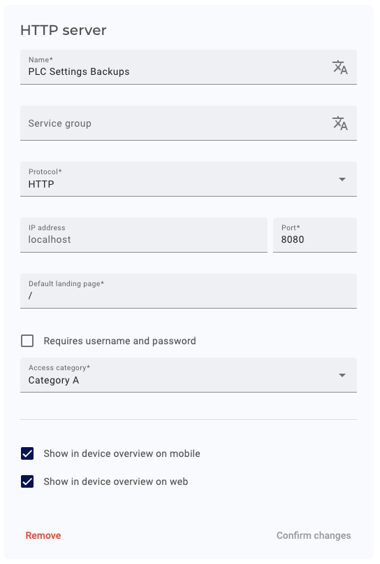

# Edge App - PLC Settings Backups for SecureEdge Pro

This project showcases how to use FTP to back up machine configurations from any FTP server (e.g., on a PLC) to the IXON SecureEdge Pro device. The provided FTP server container is included for demonstration purposes; in production environments, an FTP server on the machine should be used instead.

## Local Development

docker-compose.yml is provided for local development.

## Application Overview

This application consists of two or three containers:

1. **FTP Server** (for demonstration purposes): A simple FTP server that allows you to test the process of backing up files from an FTP server to the SecureEdge Pro. In a production environment, this container is not required, as you'd use an external FTP server on the machine itself.
2. **Backup Service**: The core service responsible for receiving the backup files from the FTP server and storing them persistently on the SecureEdge Pro device. This container handles the actual backup process.
3. **Backup Web UI**: A lightweight web interface that allows you to visualize and manage the stored backup files. It provides an easy way to view and download the backups stored by the Backup Service.

## Steps to Deploy

### Prerequisites

Ensure your environment is properly set up by following this guide: [Running custom Docker applications on the SecureEdge Pro](https://support.ixon.cloud/hc/en-us/articles/14231117531420-Running-custom-Docker-applications-on-the-SecureEdge-Pro).

### 1. Download and adjust to your SecureEdge Pro

Download the code of this project and change the IP address in the following files to the LAN IP address of your SecureEge Pro:

- buildkitd-secure-edge-pro.toml
- build_and_push_containers.sh
- build_and_push_containers.cmd

### 2. Build and Push the Containers

Ensure you have the correct build environment configured:

For Unix-based systems:

```bash
./setup-buildx-env.sh
```

For Windows:

```cmd
setup-buildx-env.cmd
```

Run the script to build and push the FTP Backup containers to the SecureEdge Pro:

For Unix-based systems:

```bash
./build_and_push_containers.sh
```

For Windows:

```cmd
build_and_push_containers.cmd
```

### 3. Set Up the Containers on SecureEdge Pro

- Access the local web interface of the SecureEdge Pro.

#### FTP Server (for demonstration purposes)

- Create an `ftp-server` container using the `ftp-server` image with the following port mappings:

  ```
  Port Mapping: 20-21:20-21/tcp, 40000-40009:40000-40009/tcp
  ```

- This container is only needed for demonstration purposes. In production, use the FTP server on the machine.

- Start the container

- Refer to the screenshot for configuration details:  
  

#### Backup Service

- Create a `backup-service` container using the `backup-service` image with the following volume mappings:

  ```
  Volume: backup_data -> /backup
  ```

This ensures that backups are persistently stored.

- Start the container

- Refer to the screenshot for configuration details:  
  

#### Backup Web UI

- Create a `backup-webui` container using the `backup-webui` image with the following port and volume mappings:

  ```
  Port Mapping: 8080:80/tcp
  Volume: backup_data -> /usr/local/apache2/htdocs/
  ```

- This allows you to access the Backup Web UI for managing and visualizing your backups.

- Start the container

- Refer to the screenshot for configuration details:  
  

### 4. Access the Backup Web UI

- In IXON Cloud, create an HTTP Web Server to easily access the Backup Web UI on the SecureEdge Pro.

- Refer to the screenshot for configuration details:  
  

### 5. You can now access the Backup Web UI on the SecureEdge Pro via the HTTP Web Server you created in IXON Cloud.
